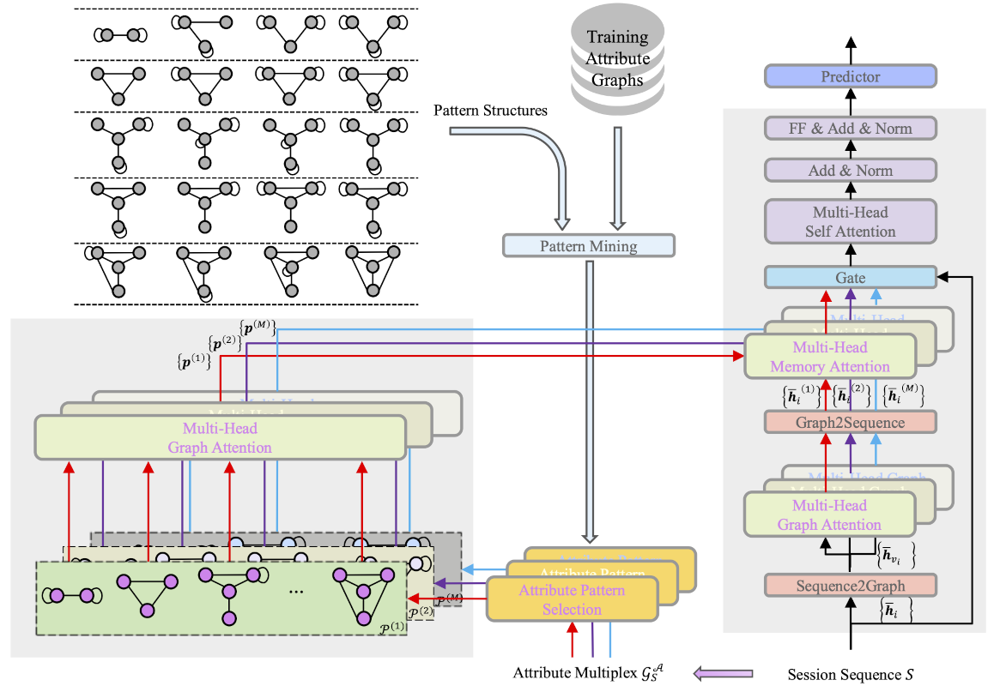

# Enhancing User Intent Capture in Session-Based Recommendation with Attribute Patterns

In this paper, we propose the Frequent Attribute Pattern Augmented Transformer (FAPAT) to utilize the attribute multiplex and characterize user intents for anonymous session-based recommendations (SBRs).
Specifically, we mine frequent and compact attribute patterns from session data. Then FAPAT efficiently retrieves relevant patterns and aligns attribute patterns and sessions in the same representation space.
We serve the patterns as memory to augment the session representations to help address the issues in session-based recommendations.

## Architecture


<!--  -->

FAPAT includes three parts:
1. frequent attribute pattern acquisition,
2. intent-aware sequence encoding,
3. next-item recommendation.

## Experiments

### Environments

Most required packages are listed in `requirements.txt`. More latest ```pytorch``` should also works. But ```python-igraph``` should no greater than ```0.9.11``` due to the newer ones do not support graphs with loops. If you do not use the graph neural networks implemented by pyg, it is not necessary to install ```torch-cluster```, ```torch-geometric```, ```torch-scatter```, ```torch-sparse```, and ```torch-spline-conv```.
Please make sure that your cuda environment (e.g., cuda-11.1) is consistent with ```cux111``` in ```requirements.txt```.

### Datasets

We conduct experiments on two public datasets (i.e., `Tmall` and `diginetica`) and Amazon data on four domains (i.e., `beauty`, `books`, `electronics`, `sporting`).
Please refer to `src/datasets` to process and split data. Or you can download the processed data from [onedrive](https://hkustconnect-my.sharepoint.com/:u:/g/personal/xliucr_connect_ust_hk/EX2s2HFGmHRKjs5QQBw3LY0BnFZiF_vnEWf6GPskR0hRng?e=2ri2m3).

### Scripts

To validate the effectiveness of FAPAT, we conduct extensive experiments on two public benchmark datasets and our four industrial datasets with more than 100 million clicks. We not only evaluate traditional next-item predictions of SBR but also extend to attribute estimations and period-item recommendations to measure the model capability to capture user intents.

To reprocude the experiments, please
1. prepare data for models in `src/mining`,
2. conduct training and evaluation in `src/recommendation`.

### Visualization

We also provide the script in `src/visualization` to draw bar graphs and curves that are used in our draft.


## References
```
@inproceedings{
    liu2023enhancing,
    title={Enhancing User Intent Capture in Session-Based Recommendation with Attribute Patterns},
    author={Xin Liu and
            Zheng Li and
            Yifan Gao and
            Jingfeng Yang and
            Tianyu Cao and
            Zhengyang Wang and
            Bing Yin and
            Yangqiu Song},
    booktitle={Thirty-seventh Conference on Neural Information Processing Systems},
    year={2023},
    url={https://openreview.net/forum?id=AV3iZlDrzF}
}
```